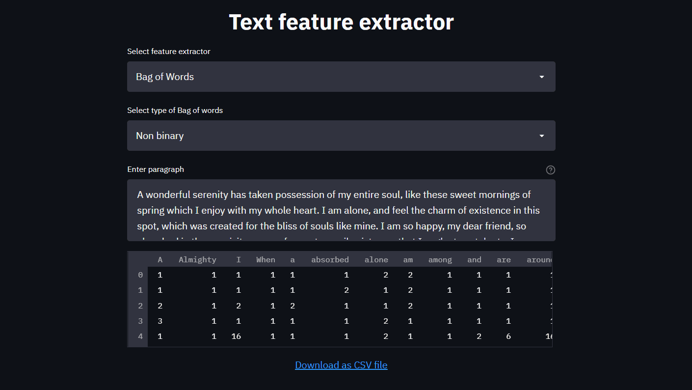

# ML-from-scratch

Implementation of machine learning algorithms from scratch.

There two implementations:
- implementation according to textbook formulae
- implementation to replicate sklearn output (In the *sklearn* folder)

## Web-app

Currently available app: *Text feature extractor* 

It's now deployed -> [Check it out!](https://textfeaturextractor.herokuapp.com/)

<p align="center">
  
</p>

## Contents

- NLP
    - Python
      - Feature extraction 
          - [Bag of words](https://github.com/Abhiswain97/ML-from-scratch/blob/master/NLP/feature_extraction/BOW.py) 
          - [TFIDF](https://github.com/Abhiswain97/ML-from-scratch/blob/master/NLP/feature_extraction/Tfidf.py) or [TFIDF-sklearn](https://github.com/Abhiswain97/ML-from-scratch/blob/master/sklearn/NLP/feature_extraction/Tfidf.py)
    - C++
      - Feature extraction
          - [Bag of Words](https://github.com/Abhiswain97/ML-from-scratch/blob/master/Cpp/NLP/feature_extraction/src/BOW.cpp)
          - [TFIDF](https://github.com/Abhiswain97/ML-from-scratch/blob/master/Cpp/NLP/feature_extraction/src/Tfidf.cpp) [It's a work in progress]   


## Running the app

Clone the repo:
```
git clone https://github.com/Abhiswain97/ML-from-scratch.git
cd ML-from-scratch
```

### Locally

- Install requirements: `pip install -r requirements.txt`

- Do, `streamlit run app.py`

### Using Docker

- Do, `docker build -f Dockerfiles\Docker-streamlit -t my-app .`

- Run it, `docker run -p 8501:8501 -t my-app`

- Now just open a browser, it's available on http://localhost:8501/

> Note: Incase you're running the app with docker, simply closing the broswer doesn't stop the app. It's still running. You need to stop the docker container. For that open powershell or git bash and do, `docker kill <container-id>` (You can get the container ID by running `docker container ls`). Then do `docker container prune`. 

## Running the Cpp examples

- Have a C++ compiler like g++ or clang++. I use clang++.

- Create a `.txt` file. Enter your required text here line-by-line. Currently, the code reads the sentences separated by newline.

- Run it, `Cpp\NLP\feature_extraction\binaries\<respective-binary> <path to your .txt file>`

> Note: Currently binary only available for Windows. For linux or mac, you need to compile and run it yourself. 
